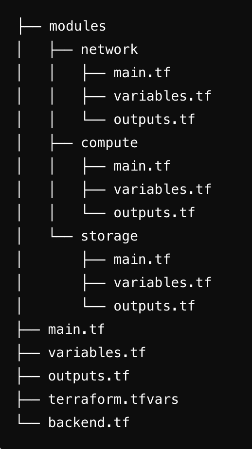

# Deploying Todo List Application with Terraform

In this task, you need to create an Azure Virtual Machine using Terraform and deploy a ToDo List application using a VM extension. The Terraform configuration will create all necessary resources, including a resource group, storage account, network security group, virtual network, subnet, public IP, and the virtual machine itself.

## Prerequisites

To complete this task, Terraform and Azure CLI must be installed and configured on your machine.

## Steps to Complete the Task

**1. Fork this Repository**

**2. Create Directory Structure**

- Create the following directory structure:

**3. Define Network Module**

- The network module will create a virtual network, subnet, network security group, and public IP address.
    * Virtual Network: name it `vnet`, address prefix `10.0.0.0/16`.
    * Subnet: name it `default`, address prefix `10.0.0.0/24`.
    * Network Security Group: name it `defaultnsg`.
    * Public IP Address: name it `linuxboxpip`, dynamic allocation method, and assign a DNS label generated by concatenating `matetask` and a random number.

**4. Define Compute Module**

- The compute module will create a network interface, virtual machine, and VM extension for deploying the ToDo List application.
    * Network Interface: name it `${var.vm_name}-nic`.
    * Virtual Machine: name it `matebox`, image `Ubuntu2204`, size `Standard_B1s`, SSH key `linuxboxsshkey`.
    * VM Extension: use `CustomScript` extension to execute `install-app.sh` script.

**5. Define Storage Module**

- The storage module will create a storage account and a storage container.
    * Storage Account: any name.
    * Storage Container: name it `task-artifacts`.

**6. Configure Remote State Backend**

- Define the backend configuration in backend.tf to store the state in Azure Blob Storage. Use the following parameters:
    * Resource Group: `mate-azure-task-12`.
    * Storage Account: `yourstorageaccount`.
    * Container Name: `tfstate`.
    * Key: `terraform.tfstate`.
- Ensure that you have a storage account and container created for the remote state. This can be included in your `main.tf` or managed separately.

**7. Use Modules in Main Configuration**
- Define variables in variables.tf with the following parameters:
    * location: `uksouth`.
    * resource_group_name: `mate-azure-task-12`.
    * virtual_network_name: `vnet`.
    * vnet_address_prefix: `10.0.0.0/16`.
    * subnet_name: `default`.
    * subnet_address_prefix: `10.0.0.0/24`.
    * network_security_group_name: `defaultnsg`.
    * public_ip_address_name: `linuxboxpip`.
    * vm_name: `matebox`.
    * vm_size: `Standard_B1s`.
    * ssh_key_public: `your-public-key-content`.
    * dns_label: `matetask` (you can append a random number in your script).

**8. Initialize and Apply the Configuration**

**9. Verify the Deployment**

- Access the virtual machine using the public IP address.
- Verify the application is running by visiting the public IP in a web browser.

**10. Pull request's description should also contain a reference to a successful workflow run**
